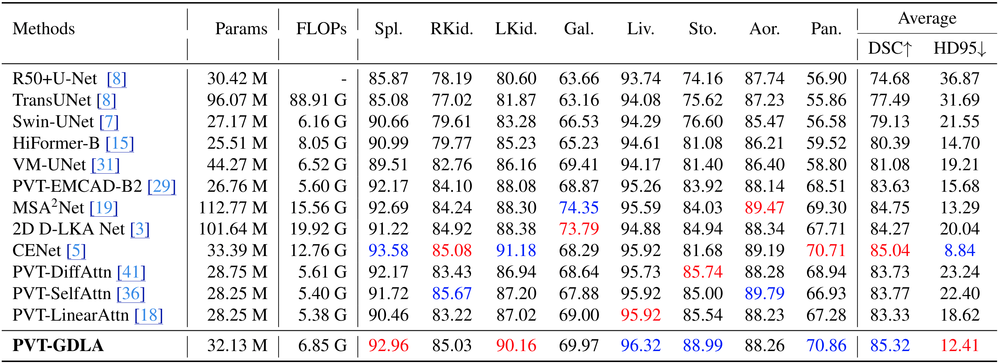
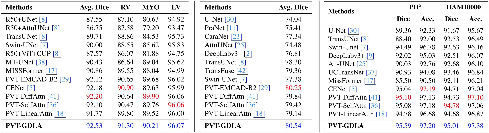
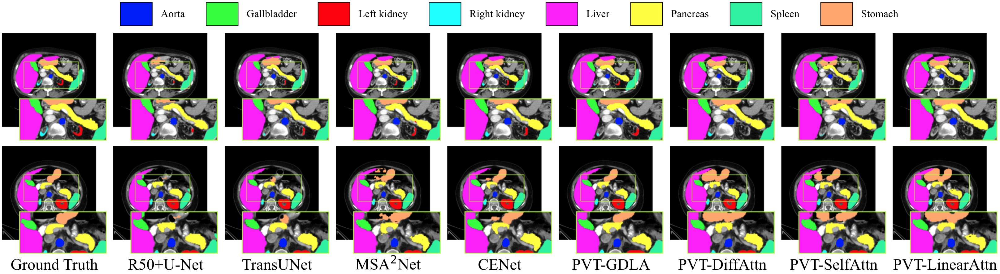

# GDLA: Gated Differential Linear Attention

[](https://openaccess.thecvf.com/content/CVPR2026F/papers/Zheng_Gated_Differential_Linear_Attention_A_Linear-Time_Decoder_for_High-Fidelity_Medical_CVPRF_2026_paper.pdf)
[](https://arxiv.org/abs/2603.02727)
[](https://github.com/xmindflow/GDLA/releases)
[](LICENSE)

Official PyTorch implementation of

> **Gated Differential Linear Attention: A Linear-Time Decoder for High-Fidelity Medical Segmentation**
> Hongbo Zheng, Afshin Bozorgpour, Dorit Merhof, Minjia Zhang
> CVPR 2026 (Findings)

Medical image segmentation needs models that preserve fine anatomical boundaries while
staying cheap enough for clinical use. Linear attention gives `O(N)` scaling but tends to
over-smooth ("attention dilution"), blurring boundaries. **Gated Differential Linear
Attention (GDLA)** is a linear-attention decoder mixer that (i) subtracts two kernelized
attention branches over complementary query/key subspaces to sharpen selectivity, (ii)
applies a data-dependent gate for token refinement, and (iii) fuses a parallel
depthwise-convolutional local-mixing branch, all while keeping `O(N)` complexity. Plugged
into a pretrained PVT-v2 encoder-decoder, **PVT-GDLA** reaches state-of-the-art accuracy
with a favorable accuracy/efficiency trade-off across CT, MRI, ultrasound, and dermoscopy.

> This repository contains the 2D medical-segmentation code and configs used for all
> experiments in the paper.

## Contents
- [Installation](#installation)
- [Pretrained encoder](#pretrained-encoder)
- [Pretrained checkpoints](#pretrained-checkpoints)
- [Datasets](#datasets)
- [Training](#training)
- [Testing](#testing)
- [Configuration system](#configuration-system)
- [Models](#models)
- [Results](#results)
- [Repository layout](#repository-layout)
- [Citation](#citation)

## Installation
Python **>= 3.10** is required.

```bash
# 1) install PyTorch for your CUDA version, see https://pytorch.org
pip install torch torchvision

# 2) install the remaining dependencies
pip install -r requirements.txt
```

## Pretrained encoder
All models initialize the PVT-v2-b2 encoder from ImageNet-pretrained weights. Download
`pvt_v2_b2.pth` from the [official PVT repo](https://github.com/whai362/PVT) and place it at
`pretrained/pvt_v2_b2.pth` (see [`pretrained/README.md`](pretrained/README.md)). Run all
commands from the repository root so the relative path resolves.

## Pretrained checkpoints
PVT-GDLA weights for all five benchmarks are attached to the
[GitHub release](https://github.com/xmindflow/GDLA/releases), one file per dataset. Each
`.ckpt` holds the model weights only; optimizer and scheduler state have been stripped, so
a file is ~129 MB. `SHA256SUMS.txt` on the same page lets you verify a download with
`sha256sum -c SHA256SUMS.txt --ignore-missing`.

Download the one matching your dataset and point `CKPT.BEST` at it, either by editing the
experiment config or on the command line:

```bash
python test_model.py \
    --cfg     cfgs/models/pvtgdla-synapse.yaml \
    --dataset cfgs/datasets/synapse.yaml \
    --opts    CKPT.BEST /path/to/checkpoint.ckpt
```

`pretrained/pvt_v2_b2.pth` must still be present: the model wrappers load the ImageNet
encoder at construction time, before the checkpoint is applied on top of it.

## Datasets
The paper evaluates five public benchmarks: **Synapse** (multi-organ CT), **ACDC** (cardiac
MRI), **BUSI** (breast ultrasound), **HAM10000** and **PH²** (dermoscopy). Download each from
its original source; none of them is redistributed here. Every loader reads
`DATA.TRAIN_DIR / VAL_DIR / TEST_DIR` from the dataset config, so the only thing you have to
do is arrange your copy in the expected layout and edit those three paths.

| Dataset | Classes | Input ch. | Train format | Val/Test format |
|---|---|---|---|---|
| Synapse | 9 | 1 | per-slice `.npz` (`image`,`label`) | per-volume `.npy.h5` (`image`,`label`) |
| ACDC | 4 | 1 | per-slice `.npz` (`img`,`label`) | per-volume `.npz` (`img`,`label`) |
| BUSI | 2 | 3 | `<case>/<case>.png` + `<case>_mask.png` | same |
| HAM10000 | 2 | 3 | `<id>/ISIC_<id>.jpg` + `ISIC_<id>_segmentation.png` | same |
| PH² | 2 | 3 | `<case>/<case>.bmp` + `<case>_lesion.bmp` | same |

### Expected on-disk layout

**RGB datasets (BUSI, HAM10000, PH², Kvasir)**: one folder per case, named after the case ID.
The loader lists the split directory, sorts it, and inside each entry opens exactly two files
whose names are derived from the folder name:

```
<TRAIN_DIR>/                        <TRAIN_DIR>/
├── benign (1)/                     ├── 0024312/
│   ├── benign (1).png              │   ├── ISIC_0024312.jpg
│   └── benign (1)_mask.png         │   └── ISIC_0024312_segmentation.png
└── ...            (BUSI)           └── ...            (HAM10000)

<TRAIN_DIR>/
├── IMD002/
│   ├── IMD002.bmp
│   └── IMD002_lesion.bmp
└── ...            (PH²)
```

Masks are read as grayscale and binarized by the transform. Every entry in a split directory
must be a case folder; a stray `.DS_Store` or loose image will raise `NotADirectoryError`.

**Volumetric datasets (Synapse, ACDC)**: flat directories of array files, following the
[TransUNet](https://github.com/Beckschen/TransUNet) preprocessing protocol: 2D slices for
training, whole volumes for evaluation.

```
<TRAIN_DIR>/case0005_slice000.npz     # arrays: image [H,W],   label [H,W]
<TEST_DIR>/case0001.npy.h5            # datasets: image [D,H,W], label [D,H,W]      (Synapse)

<TRAIN_DIR>/case_001_sliceED_0.npz    # arrays: img [H,W],     label [H,W]
<TEST_DIR>/case_002_volume_ED.npz     # arrays: img [D,H,W],   label [D,H,W]        (ACDC)
```

Note the key names differ: Synapse uses `image`/`label`, ACDC uses `img`/`label`. The
evaluation loop switches to volume-wise inference automatically when a sample is 3D, so
val/test configs use `BATCH_SIZE: 1` for these two.

The case-ID lists for the PH² split and the HAM10000 test set are in
[`splits/`](splits/README.md), together with notes on how the remaining splits were formed.

> `kvasir` (polyp segmentation) is also supported but is **not** part of the paper's reported
> benchmarks.

### Running on your own data
If your data already fits one of the layouts above, you only need to point the config at it,
no code changes:

1. **Set the paths.** Edit `DATA.ROOT_DIR / TRAIN_DIR / VAL_DIR / TEST_DIR` in
   `cfgs/datasets/<name>.yaml`, or override them per run with `--opts`:
   ```bash
   python train_model.py \
       --cfg     cfgs/models/pvtgdla-busi.yaml \
       --dataset cfgs/datasets/busi.yaml \
       --opts    DATA.TRAIN_DIR /my/data/train DATA.VAL_DIR /my/data/val
   ```
2. **Match the schedule to your split size.** `TRAIN.N_ITER_PER_EPOCH` in the model config
   drives the cosine LR schedule and must equal
   `ceil(num_train_samples / LOADER.TRAIN.BATCH_SIZE)`. If you change the split or the batch
   size and forget this, the LR schedule will not span the run.
3. **Match the model head.** `MODEL.N_CLASSES` is the number of classes *including*
   background (2 for binary segmentation) and `MODEL.IN_CHS` is the channel count of the
   input the `ResBlk` stem sees: 3 for RGB, 1 for grayscale slices. Both live in the model
   config.

For a genuinely new format, add a loader instead: write a `torch.utils.data.Dataset` under
`datasets/<name>/`, register its builder with `@DATASET.register(name="<name>")`, import it in
`datasets/__init__.py`, and add a `cfgs/datasets/<name>.yaml` with `DATA.NAME: "<name>"`.
`datasets/busi/` is the shortest example to copy. The builder returns
`{'train': ..., 'val': ..., 'test': ...}` mapping each split to a **callable** that constructs
the dataset (`partial(MyDataset, data_dir=..., transform=...)`), so that a split is only built
when something asks for it. Each `__getitem__` must return
`{"image": Tensor[C,H,W], "label": Tensor[H,W]}` with integer class indices in `label`.

> All loaders read their entire split into memory up front, which keeps epochs fast but means
> a large split needs proportional RAM. Switch `_load` to store file paths and decode inside
> `__getitem__` if that is a problem for your dataset.

## Training
```bash
python train_model.py \
    --cfg     cfgs/models/pvtgdla-synapse.yaml \
    --dataset cfgs/datasets/synapse.yaml
```
`--cfg` selects the experiment (model + training schedule); `--dataset` supplies the data
paths. Checkpoints and a `stats.json` training log are written to the config's `CKPT.DIR`
(default `checkpoints/<model>-<dataset>/`), and training resumes automatically from
`last.ckpt` if present.

## Testing
```bash
python test_model.py \
    --cfg     cfgs/models/pvtgdla-synapse.yaml \
    --dataset cfgs/datasets/synapse.yaml
```
This loads `CKPT.BEST` and reports the per-class and average Dice score. The 95th-percentile
Hausdorff distance (HD95, reported for Synapse in the paper) is implemented in `val.py` but
commented out by default because it is slow to evaluate; uncomment that block to enable it.

## Configuration system
Each run is specified by **two** [yacs](https://github.com/rbgirshick/yacs) YAML files:

- `--cfg cfgs/models/<model>-<dataset>.yaml`: the **experiment**, i.e. which model, number of
  classes / input channels, optimizer, LR schedule, loss, batch sizes, epochs, and the
  checkpoint directory (`CKPT.DIR`).
- `--dataset cfgs/datasets/<dataset>.yaml`: the **dataset**, i.e. the `TRAIN/VAL/TEST_DIR` paths,
  input size, and augmentation.

We ship experiment configs for **PVT-GDLA on all six datasets** and for the **three baselines
on the five paper datasets**. To make a new combination, copy the closest config and edit
`MODEL.NAME` (and its RoPE block), `MODEL.N_CLASSES`, and the training schedule. When you
change `LOADER.TRAIN.BATCH_SIZE`, also update `TRAIN.N_ITER_PER_EPOCH`
(≈ `ceil(num_train_samples / batch_size)`) so the cosine schedule spans the whole run.

## Models
| `MODEL.NAME` | Decoder | Description |
|---|---|---|
| `pvtgdla` | Gated Differential Linear Attention | **proposed (PVT-GDLA)** |
| `pvtda`   | Multi-head differential attention | baseline (PVT-DiffAttn) |
| `pvtsa`   | Multi-head softmax self-attention | baseline (PVT-SelfAttn) |
| `pvtla`   | Multi-head kernelized linear attention | baseline (PVT-LinearAttn) |

The self-/differential-attention baselines use RoPE; linear attention does not (it was
unstable in our experiments). These flags are set in the corresponding model config.

## Results
Synapse multi-organ CT (Table 1 of the paper): per-organ Dice, average DSC and HD95, with
parameter and FLOP counts.



ACDC cardiac MRI, BUSI breast ultrasound, and the PH2 / HAM10000 dermoscopy benchmarks
(Table 2 of the paper).



Qualitative comparison on Synapse (Figure 4 of the paper).



All models were trained on a single NVIDIA L40S (46 GB) at 224 x 224 with the BDoU loss.
Per-dataset schedules (epochs / warmup / batch size, all with AdamW at `5e-4`) are baked
into `cfgs/models/*.yaml`: Synapse 200/10/8, ACDC 150/10/16, BUSI 100/10/16,
HAM10000 150/10/16, PH2 100/5/16.

## Repository layout
```
.
├── cfgs/
│   ├── models/          # experiment configs: <model>-<dataset>.yaml (model + training schedule)
│   └── datasets/        # dataset configs: data paths, input size, augmentation
├── criterions/          # BDoU (boundary) / Dice / DiceCE losses
├── datasets/            # per-dataset loaders + transforms
├── models/              # PVT-v2 encoder + PVT-{GDLA,DA,SA,LA} wrappers
├── modules/             # attention/decoder/FFN building blocks (GDLA lives in modules/attn/gdla.py)
├── assets/              # result tables and qualitative figures used in this README
├── pretrained/          # place pvt_v2_b2.pth here
├── splits/              # case-ID lists for the PH2 split and the HAM10000 test set
├── train_model.py       # training entry point
├── test_model.py        # evaluation entry point
└── requirements.txt
```

## Citation
```bibtex
@InProceedings{Zheng_2026_CVPR,
    author    = {Zheng, Hongbo and Bozorgpour, Afshin and Merhof, Dorit and Zhang, Minjia},
    title     = {Gated Differential Linear Attention: A Linear-Time Decoder for High-Fidelity Medical Segmentation},
    booktitle = {Proceedings of the IEEE/CVF Conference on Computer Vision and Pattern Recognition (CVPR) Findings},
    month     = {June},
    year      = {2026},
    pages     = {5579-5588}
}
```

## License
Released under the [MIT License](LICENSE).
